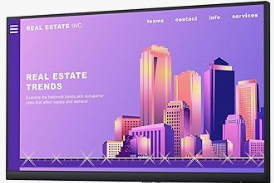

# Site-Layout - Front-end

Encontrei uma imagem de um monitor na internet com um layout na tela, aí eu resolvi tirar uma print, e fazer o site apresentado na imagem com HTML & CSS.

Para visualizar o site... acesse ACTIONS!
